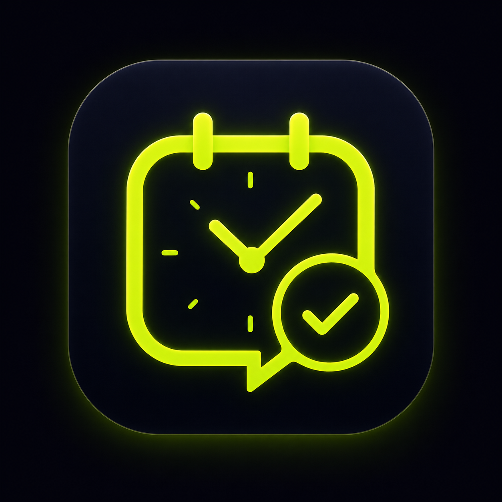

# CUÁNDO — Premium V2

Versión premium estática para `CUÁNDO`, lista para subir a Vercel, Netlify o cualquier hosting estático.

## Qué incluye

- Landing cinematográfica con fondo oscuro, glow, partículas y microanimaciones.
- Loader premium de marca.
- Mockup de móvil animado.
- Secciones: problema, cómo funciona, demo visual, creador de plan, resultado, funciones, casos de uso y FAQ.
- Demo funcional para crear un plan.
- Link de plan generado.
- Botón de compartir por WhatsApp.
- Ranking visual con Smart Match V1.
- Generador de story PNG.
- Exportación a calendario `.ics`.
- Carpeta lista para videos MP4/WebM.

## Estructura

```txt
cuando_v2_premium/
├─ index.html
├─ css/styles.css
├─ js/app.js
├─ assets/img/hero-bg.jpg
├─ assets/img/share-visual.jpg
└─ assets/videos/README.txt
```

## Cómo abrir

Abre `index.html` directamente en el navegador o súbelo a Vercel.

## Cómo cambiar el logo

Ahora el logo está construido en CSS con el signo `?`. Si tienes el PNG oficial de CUÁNDO, reemplaza la clase `.brand-mark` por una imagen:

```html

```

Recuerda mantenerlo en PNG con fondo transparente.

## Videos

Coloca tus videos dentro de `assets/videos/` y reemplaza los `` de las tarjetas por `<video autoplay muted loop playsinline>`.
